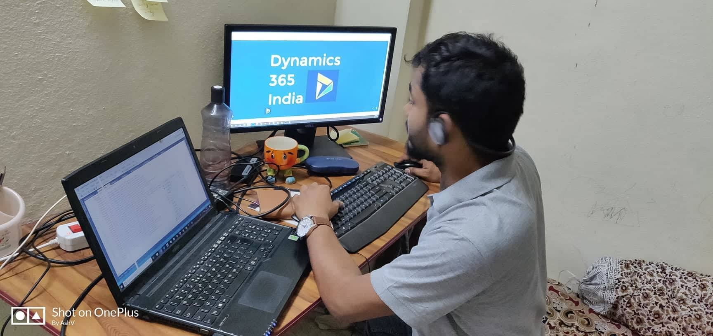

# Virtual Entities In Dynamics 365 (Webinar Content)

## Event URL
[http://www.dynamics365india.org/Events/2018/August/5/Virtual-Entities-In-Dynamics-365/](http://www.dynamics365india.org/Events/2018/August/5/Virtual-Entities-In-Dynamics-365/)

-----

-----

## Slides
<iframe src="//slides.com/ashv/virtual-entities-in-dynamics-365/embed" width="100%" height="500" scrolling="no" frameborder="0" webkitallowfullscreen mozallowfullscreen allowfullscreen></iframe>

-----

## Recording
<iframe width="100%" height="500" src="https://www.youtube.com/embed/Ft_IqbbvNp0" frameborder="0" allow="autoplay; encrypted-media" allowfullscreen></iframe>

-----

## GitHub Repo for Code used during webinar

[https://github.com/AshV/Virtual-Entity-Dynamics-365](https://github.com/AshV/Virtual-Entity-Dynamics-365)

1. Asp.Net WebAPI code for OData V4 Data Provider
[https://github.com/AshV/Virtual-Entity-Dynamics-365/tree/master/EBooksODataAPI](https://github.com/AshV/Virtual-Entity-Dynamics-365/tree/master/EBooksODataAPI)

2. Code for Custom Data Provider 
[https://github.com/AshV/Virtual-Entity-Dynamics-365/tree/master/EBook-CustomDataProvider](https://github.com/AshV/Virtual-Entity-Dynamics-365/tree/master/EBook-CustomDataProvider)

3. Code to interact with CosmosDB trial
[https://github.com/AshV/Virtual-Entity-Dynamics-365/tree/master/To-Access-CosmosDB-Trial-Instance](https://github.com/AshV/Virtual-Entity-Dynamics-365/tree/master/To-Access-CosmosDB-Trial-Instance)

----

## Azure resources to try out samples discussed during webinar
(I will remain them deployed until 15 August 2018, to try out examples by attendees)

**CosmosDB Credentials**
URI : [https://ve-demo.documents.azure.com:443/](https://ve-demo.documents.azure.com:443/)
Database Name : ToDoList
Collection : Items
Primary Key : xFAuNvaHDqH2TqbLqBSvIFWhG1st30xUKj29oTk4zPzWGJYn99vB7jlKAsW4AZpzmKLUSYV7rGFPl9GhKrRWtQ==

**OData V4 API Endpoint**
[https://d365in-virtual-entity-demo.azurewebsites.net/](https://d365in-virtual-entity-demo.azurewebsites.net/)

-----

[If you wish to present any topis please click here](http://www.dynamics365india.org/Speaker)

[Subscribe for Updates from Dynamics 365 India](https://goo.gl/uGA82i)

-----